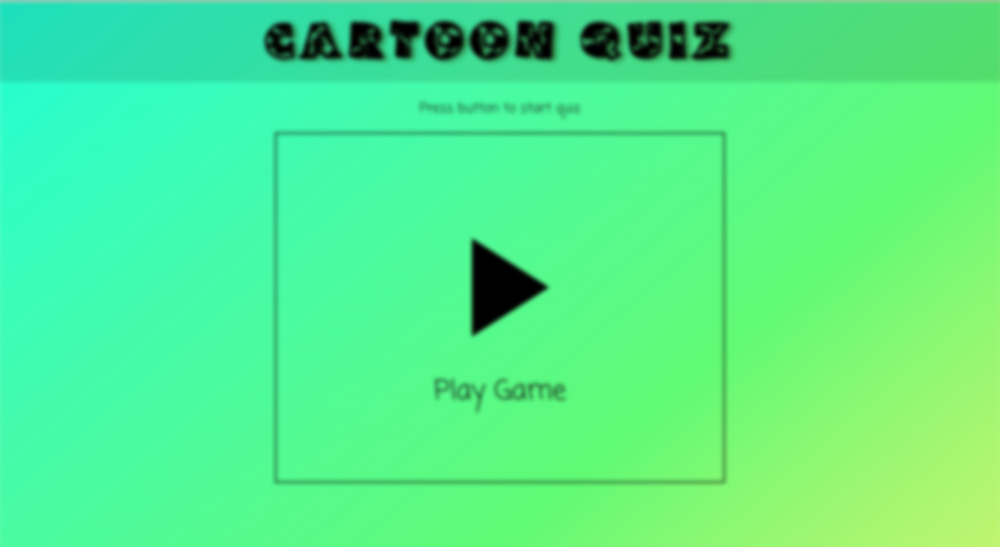
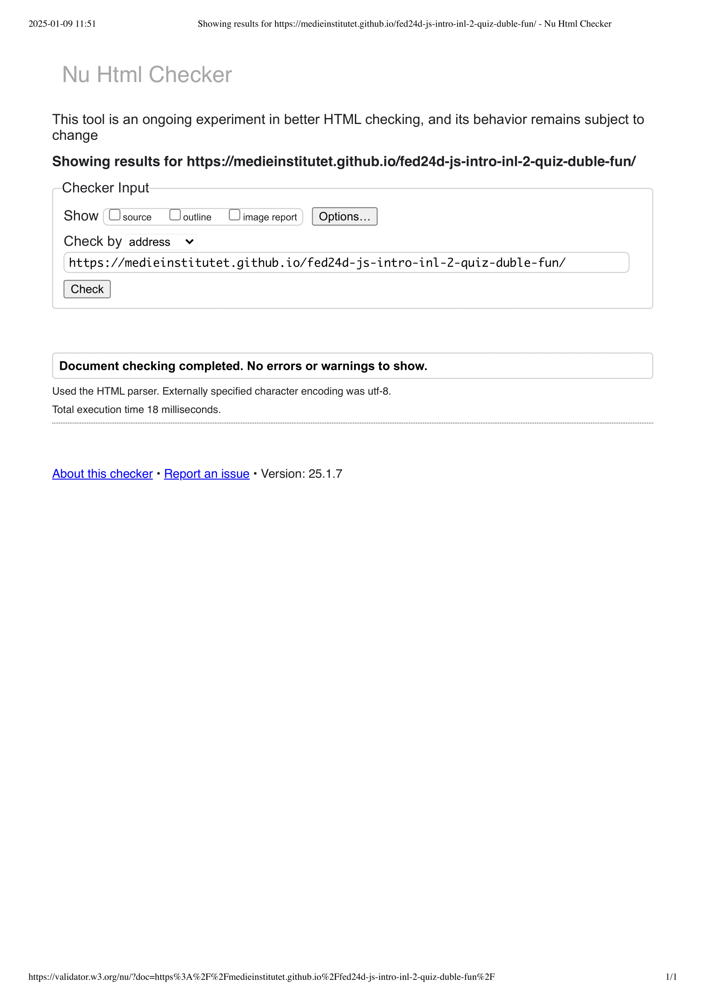
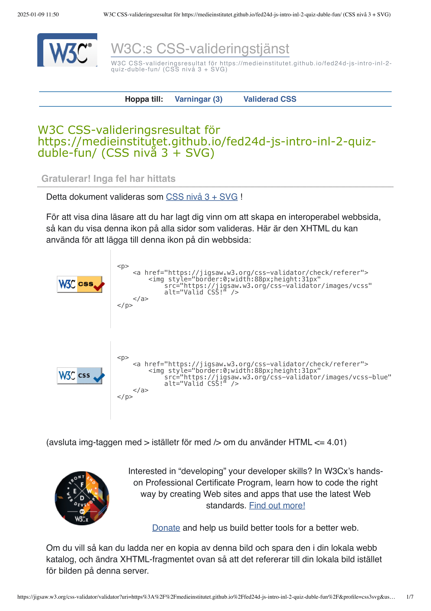
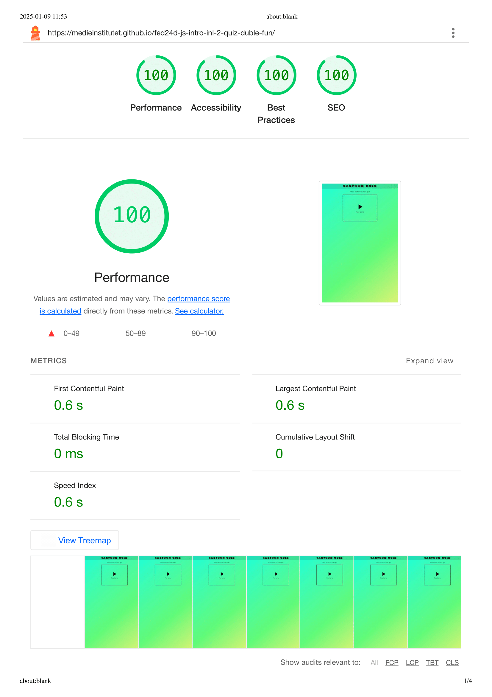

# Cartoon Quiz

This project was developed as a school group-project at Medieinstitutet. 

The aim was to create a quiz in theme of choice.
We chose to create a quiz about cartoons because it felt fun to play with happy colors.

Troughout this project we focused on learning how to work as a group, both individually and pair coding. I hope you enjoy. 

## Requirements for this assigment

* Create a quiz with 20 questions
* Each question should have 3 answer options, and only 1 option should be correct.
* The questions should be presented in random order, with 10 questions shown per round.
* If the user chooses to play again, the same 10 questions should not appear again.
* Points should be awarded for correct answers.
* Only one question should be displayed at a time on the screen.
* Timer (counting upwards). The timer should stop once all questions have been answered.
* A confirmation box should display the number of correct answers (out of the total number of questions) and the total time taken.
* Each person should have made at least two pull requests.
* Work with the project according to the agile method, SCRUM. 

## Live published site

[Click here for live published version](https://medieinstitutet.github.io/fed24d-js-intro-inl-2-quiz-duble-fun/)

**Language: English**

## Sneak peak

## Tech Stack

**HTML** | **JavaScript** | **TypeScript** | **SCSS** | **Prettier** | **EsLint** | **Vite**

## Color References

| Color             | Hex                                                                |
| ----------------- | ------------------------------------------------------------------ |
| Primary color |  #000000 |
| Secondary color |  #ffffff |
| Wrong answer color |  #ff0000 |
| Right answer color |  #008000 |
| Hover Color |  #00800030 |

| Linear gradient            | Hex                                                                |
| ----------------- | ------------------------------------------------------------------ |
| 0% |  #dcf26e |
| 37% |  #61fa74 |
| 100% |  #1cfdd6 |

## Fonts

| Font             |                                                                 |
| ----------------- | ------------------------------------------------------------------ |
| Primary font | "Coming Soon", serif;  |
| Secondary font | "Moo Lah Lah", serif; |

## Validation & a11y

### HTML

### CSS 

### Lighthouse Analyze

## Authors

|             |                                                               |
| ----------------- | ------------------------------------------------------------------ |
| Mikaela Kihl |  |
| Matilda Söderhäll | |
| Nicole Sjöberg-Silfverling | |
| Vy Petersson|  |
| Sokol Hatija|  |
